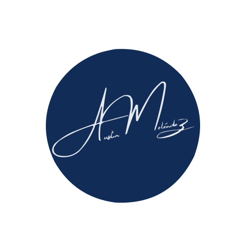
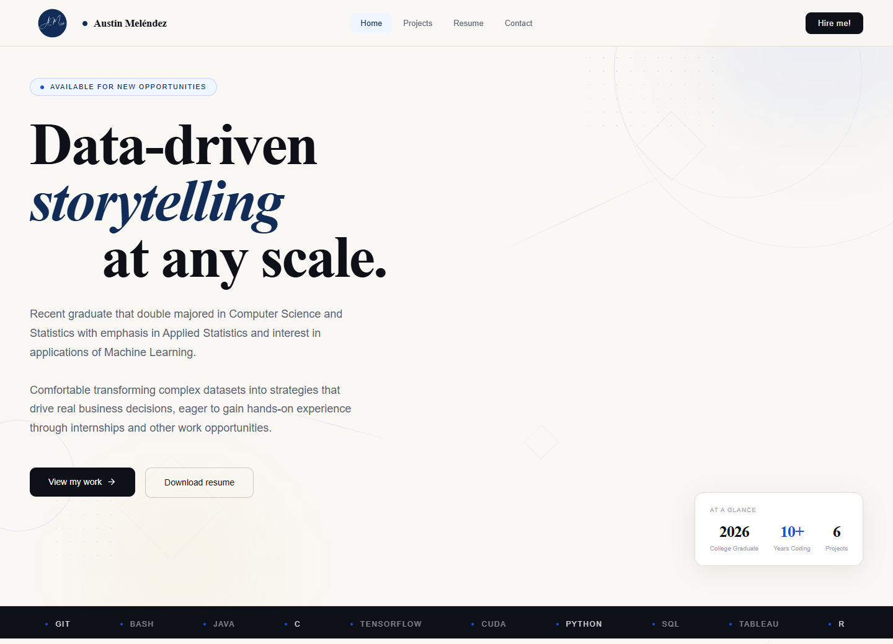

  

<h1 align="center">Austin Meléndez</h1>

  <strong>Data Science &amp; Analytics Portfolio</strong> 
  Turning complex data into clear decisions.

  
  
  

  <a href="#featured-work">Featured work</a> &nbsp;·&nbsp;
  <a href="https://www.linkedin.com/in/austin-melendez">LinkedIn</a> &nbsp;·&nbsp;
  <a href="https://github.com/austin-mel">GitHub</a> &nbsp;·&nbsp;
  <a href="https://austinmelendez.com/contact">Contact</a>

---

I turn complex data into **clear findings, practical recommendations, and usable tools**. My work combines statistical analysis, simulation, and software development, with case studies that explain the question, my contribution, the evidence, and what the results mean.

I am a **Computer Science and Statistics graduate from California State University, Sacramento**, based in Sacramento and open to remote opportunities in data analysis, business intelligence, and applied analytics.

A preview of my portfolio website · Select the image to explore the live website.

## Featured work

From evaluating evidence to building tools people can use. Browse the [projects overview page](https://austinmelendez.com/projects) on my portfolio, or explore a featured case study below.

### 01 · Understanding noise in scientific measurements

*Python · Statistical modeling · Client report*

**The question** — Can a scientific instrument use the same background-noise correction across all measurement settings?

**My approach** — I cleaned and analyzed **492,000 observations from 71 instrument runs**, compared six measurement durations, and built statistical models in Python.

> **Key finding:** Background noise changed with measurement duration, supporting a separate correction for each setting. The result gives the client a basis for choosing corrections to validate on new samples.

**[View project ↗](https://austinmelendez.com/projects/baseline-noise)** &nbsp;·&nbsp; [Read the technical report (PDF)](src/assets/projects/baseline/Baseline%20Noise%20Report.pdf) &nbsp;·&nbsp; [GitHub repository](https://github.com/austin-mel-edu/sacramento-state-university/tree/master/STAT192%20-%20Senior%20Capstone%20Project/Adam%20G%20-%20Thermochron%20Systems%20LLC)

---

### 02 · Evaluating empathy in science communication

*R · Survey analysis · Client report*

**The question** — Did an empathy-focused science communication intervention improve survey scores more than a control condition?

**My approach** — I prepared matched before-and-after survey records for **222 participants** and used statistical comparisons and regression in R.

> **Key finding:** Self-reported empathy increased overall, but the intervention group did not improve significantly more than the control group. The analysis helps stakeholders report the improvement without claiming an intervention advantage that the evidence did not establish.

**[View project ↗](https://austinmelendez.com/projects/science-communication-empathy)** &nbsp;·&nbsp; [Read the technical report (PDF)](src/assets/projects/scicomm/SciComm%20Empathy%20Report.pdf) &nbsp;·&nbsp; [GitHub repository](https://github.com/austin-mel-edu/sacramento-state-university/tree/master/STAT192%20-%20Senior%20Capstone%20Project/Shelby%20C%20-%20CSUS%20Biological%20Sciences%20Dept)

---

### 03 · Exploring disease spread through simulation

*R · Simulation · Reusable package*

**The question** — How do assumptions about infection, recovery, and immunity change simulated disease spread?

**My approach** — I built a tested R package that models disease spread across a grid, compares repeated runs, and produces charts and heatmaps.

> **What it delivers:** Eight public functions for reproducing scenarios and inspecting how changing assumptions affects outcomes. The package demonstrates simulation methods; it is not calibrated to forecast a real epidemic.

**[View project ↗](https://austinmelendez.com/projects/sirs-simulation)** &nbsp;·&nbsp; [GitHub repository](https://github.com/austin-mel/sirmodelsimulation)

---

### 04 · Measuring when events happen in a simulation

*R · Survival analysis · Reproducible workflow*

**The question** — How can simulation logs reveal when infection, recovery, or death occurs, including cases where an event is not observed before the run ends?

**My approach** — I converted one fixed simulation of **100 population units** into a dataset for analyzing time until an event, then created survival curves in R.

> **What it delivers:** A reproducible workflow that preserves both observed events and incomplete observations, making its assumptions visible. This is a methods demonstration based on one simulated run.

**[View project ↗](https://austinmelendez.com/projects/sirs-survival-analysis)** &nbsp;·&nbsp; [GitHub repository](https://github.com/austin-mel/sirsurvivalanalysis)

---

### 05 · Making a complex clinical-trial workflow easier to follow

*Vue · TypeScript · Express · PostgreSQL*

**The question** — How can hospital, sponsor, and regulator roles coordinate a trial through one shared application?

**My approach** — I built a fictional portal with role-specific screens, database-backed actions, and workflows for review, enrollment, reporting, and disclosure.

> **What it delivers:** An interface connected to the rules and data behind it, showing how I translate process requirements into working software. It uses synthetic data and is a demonstration, not a production clinical system.

**[View project ↗](https://austinmelendez.com/projects/pharmatrial)** &nbsp;·&nbsp; [Try the demo](https://austin-mel.github.io/csc131-mock-pharmatrial-portal/) &nbsp;·&nbsp; [GitHub repository](https://github.com/austin-mel/csc131-mock-pharmatrial-portal)

---

## Let's work together

Interested in applying data to a practical problem? I'm open to opportunities in **data analysis, business intelligence, and applied analytics**.

**[Get in touch](https://www.austinmelendez.com/contact)** &nbsp;·&nbsp; [Connect on LinkedIn](https://www.linkedin.com/in/austin-melendez) &nbsp;·&nbsp; [Read my résumé](src/assets/austin-melendez-resume.pdf) &nbsp;·&nbsp; [Read my CV](src/assets/austin-melendez-cv.pdf)

<strong>Credits &amp; licensing</strong>

Portfolio by **Austin Meléndez**. The consulting case studies document work with Thermochron Systems LLC and Sacramento State's Biological Sciences department; project reports and linked repositories provide the study context and supporting materials. Organization names and logos in the fictional clinical-trial demo are part of its demonstration content.

The website is built with [Vue](https://vuejs.org/), [Vue Router](https://router.vuejs.org/), [Vite](https://vite.dev/), and [Tailwind CSS](https://tailwindcss.com/), and hosted on [GitHub Pages](https://pages.github.com/).

This website repository does not currently include a `LICENSE` file. Refer to the linked project repositories for their own license information and credits.

